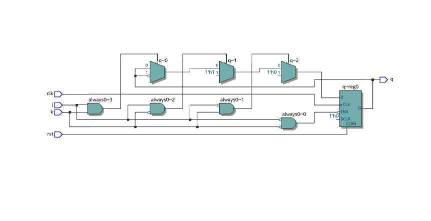
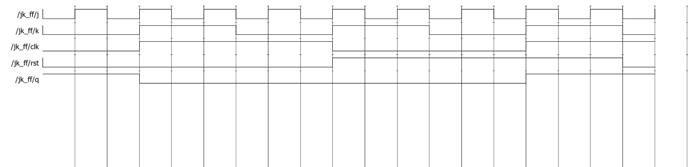

# JKFLIPFLOP-USING-IF-ELSE

**AIM:** 

To implement  JK flipflop using verilog and validating their functionality using their functional tables

**SOFTWARE REQUIRED:**

Quartus prime

**THEORY**

**JK Flip-Flop**

JK flip-flop is the modified version of SR flip-flop. It operates with only positive clock transitions or negative clock transitions. The circuit diagram of JK flip-flop is shown in the following figure.


This circuit has two inputs J & K and two outputs Qtt & Qtt’. The operation of JK flip-flop is similar to SR flip-flop. Here, we considered the inputs of SR flip-flop as S = J Qtt’ and R = KQtt in order to utilize the modified SR flip-flop for 4 combinations of inputs. The following table shows the state table of JK flip-flop.


 
Here, Qtt & Qt+1t+1 are present state & next state respectively. So, JK flip-flop can be used for one of these four functions such as Hold, Reset, Set & Complement of present state based on the input conditions, when positive transition of clock signal is applied. The following table shows the characteristic table of JK flip-flop. Present Inputs Present State Next State
 


By using three variable K-Map, we can get the simplified expression for next state, Qt+1t+1. Three variable K-Map for next state, Qt+1t+1 is shown in the following figure.
 


The maximum possible groupings of adjacent ones are already shown in the figure. Therefore, the simplified expression for next state Qt+1t+1 is Q(t+1)=JQ(t)′+K′Q(t)Q(t+1)=JQ(t)′+K′Q(t)

**Procedure**

/* write all the steps invloved */

**PROGRAM**

```
/* Program for flipflops and verify its truth table in quartus using Verilog programming. JK FLIPFLOP USING IF ELSE STATEMENT

module jk_ff (j, k, clk, rst, q); input j, k, clk, rst; output reg q; always @(posedge clk or posedge rst) begin if (rst) q <= 0; // Reset the flip-flop else if (j == 0 && k == 0) q <= q; // No change else if (j == 0 && k == 1) q <= 0; // Reset else if (j == 1 && k == 0) q <= 1; // Set else if (j == 1 && k == 1) q <= ~q; // Toggle end endmodule

(OR) JK FLIPFLOP

module jkff(j,k,clk,q,qbar); input j,k,clk; output reg q,qbar; initial
begin q=1'b0; qbar=1'b1; end

always @(posedge clk) begin
q<=(j&~q)|(~k&q); qbar<=~q; end endmodule

```
 Developed by:Yuvasri V
  RegisterNumber:25008890
*/

**RTL LOGIC FOR FLIPFLOPS**



**TIMING DIGRAMS FOR FLIP FLOPS**



**RESULTS**

Thus JK flipflop using verilog and validating their functionality using their functional tables is verified.
